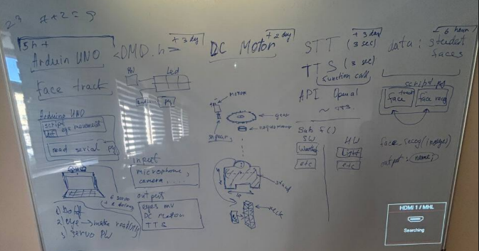
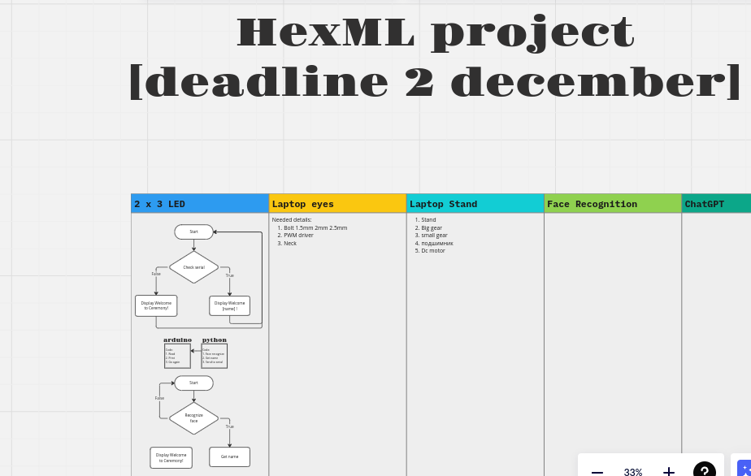

# HexML
Robotic assistant, which make your laptop more realistic with eyes to control HARDWARE and SOFTWARE actions

### **Abstract plan:**

As you can see, i devided project into 4 pieces.(Разделяй и властвуй)

## Resources:
* https://www.instructables.com/Simplified-3D-Printed-Animatronic-Dual-Eye-Mechani/ (eye mechanism)
* https://t.me/Inventor_admin (user who printed 3d objects)
* https://tutorials.probots.co.in/what-is-a-p10-matrix-display/ (led matrix)
* https://arduino.ru/forum/programmirovanie/led-matrix-p10-shrifty (led matrix)
* https://youtu.be/JMgXu1rFDJ0?si=i_ejf0mvJhyc3T6j (understand which gear is the best one)
* https://youtu.be/5yPeKQzCPdI?si=iKUTBOYfgqEPdI7j (face recognition)
* https://github.com/Uberi/speech_recognition/blob/master/examples/microphone_recognition.py (speech recognition)
* https://platform.openai.com/docs/api-reference/introduction (openai docs)